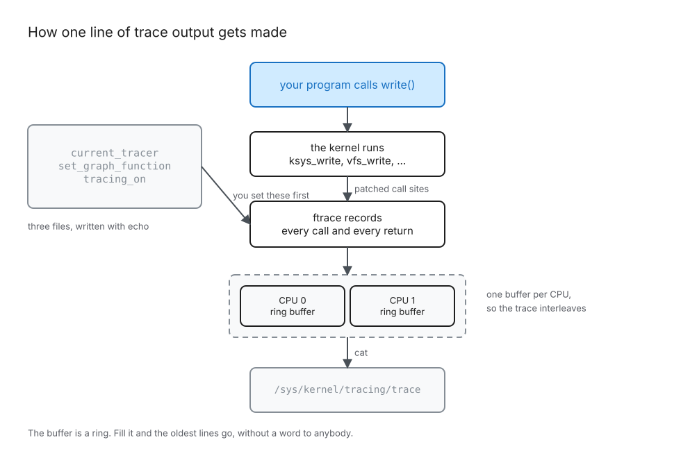

# Z02: Your first trace

**Status: draft.** The prose is finished. None of its claims are verified, because verifying them needs a kernel you can run in a browser tab and that is still being built. See "What is not settled yet" at the end, which says exactly what is missing and what will fix it.

<!-- block: hook -->

Open a file, write one byte, close it. Three lines of C. On the way through, the kernel does something on the order of a hundred function calls, takes and drops several locks, walks a page cache, and decides whether anything needs to hit a disk.

You are about to watch all of it happen, by name, in order, with a time next to each one.

Not a diagram of what the kernel probably does. The actual calls your actual kernel made, the moment you asked it to. The machinery for this ships in the kernel, it has been there for years, and turning it on takes two `echo` commands.

Before you turn it on, answer this: how many function calls does a one byte write take? Write down a number. You will be wrong, and how you are wrong is the interesting part.

<!-- block: predict -->

## Predict

Write these down before you run anything. The notebook will hold you to them, and it will not show you the answer until you have committed.

1. How many function calls does writing one byte take? Give an order of magnitude: ten, a hundred, a thousand, ten thousand.
2. What is the name of the outermost kernel function you will see, the one everything else happens inside?
3. How deep does the call stack go? Give a number.
4. Does the write reach the disk before your program's `write()` call returns?

Nobody expects you to get these right. The point of writing them down is that a prediction you got wrong sticks, and a fact you read passively does not.

<!-- block: tour -->

## Where the controls are

Everything lives in one directory, `/sys/kernel/tracing`. It is a filesystem interface, so the whole tracer is driven by reading and writing files, and you can do all of it from a shell.

Four files matter today:

- `current_tracer`, which tracer is running. Write `function_graph` into it.
- `set_graph_function`, which functions to follow. Empty means all of them, which is more output than you want.
- `tracing_on`, a `1` or a `0`. This is the switch you flip around the thing you want to see.
- `trace`, the output. Read it.



The picture leaves out a lot. There is no tracepoint layer in it, no buffer sizing, no locking on the reader side. It has the pieces you need to read the next section and nothing else, which is the job of the first diagram in a book.

## What a line looks like

Here is the shape of the output. The values are written as placeholders, because the real numbers come from your machine and not from mine:

```
 <cpu>)   <duration> us  |  vfs_write() {
 <cpu>)   <duration> us  |    rw_verify_area();
 <cpu>) ! <duration> us  |    __kernel_write_iter() {
 <cpu>)   <duration> us  |      some_leaf_function();
 <cpu>) ! <duration> us  |    }
 <cpu>) # <duration> us  |  }
```

Read it left to right.

The number in brackets is the CPU. Hold on to that one, it is the thing this lesson exists to teach you.

The duration is in microseconds, and the character in front of it is a slowness marker. The kernel prints the marker rather than the number it stands for, so the table is something you have to know: `+` is over 10 us, `!` is over 100 us, `#` is over 1000 us, `*` is over 10 ms, `@` is over 100 ms, and `$` is over 1 s. When you see `#` you are looking at a millisecond of kernel time, which for a write to a file that is already in memory is a long time and worth asking about.

After the bar comes the indentation, two spaces per level, and then the function.

A function that called something else gets two lines, one with `{` when it was entered and one with `}` when it returned, and the duration lands on the closing line because that is the first moment the kernel knew it. A function that called nothing gets one line ending in `;`, with its duration right there. So a leaf costs one line and a branch costs two, and if you count lines expecting to count calls, your number will be somewhere between the two.

## The thing that will catch you

The trace file holds the output of every CPU, interleaved, in one stream.

That means the indentation you are reading belongs to a CPU, not to the file. Two lines sitting next to each other can come from two unrelated call stacks on two different cores, and the second one is not inside the first one no matter how it is indented. If you build a tree out of this by tracking one depth counter, you will get a tree. It will look fine. It will be wrong, and it will be wrong in a way that survives a lot of reading, because the shape stays plausible.

There is one depth per CPU. The parser in `kxray.trace` keeps one stack per CPU for exactly this reason, and the first test written against it was the one with two CPUs interleaved.

On Tier 0 you will not see this, because v86 gives you a single processor and every line says `0)`. That makes it a good place to learn the format and a bad place to learn the trap, so the trap is here in writing, and the two CPU capture is a Tier 1 experiment.

## The buffer is a ring

The kernel is not writing to a file. It is writing into a fixed size ring buffer, one per CPU, and the `trace` file is a view onto that buffer.

Fill it and the oldest entries go, without an error, without a warning, and without a gap in the output where the missing lines were. The count of what was dropped is in `per_cpu/cpu0/stats`, in a field called `overrun`, and if you never look at that file you will never know it happened.

This is the single most common way to be confused by ftrace. The function you were looking for is not missing, it scrolled. Trace less, or trace for a shorter time, or make the buffer bigger with `buffer_size_kb`.

## Watching changes what you watch

Turning on `function_graph` puts a real cost on every function the kernel calls, because every one of them now has a recording step at the entry and at the return.

So the durations you are reading are the durations of a kernel that is being traced. They are true, and they are not what the same code costs when nobody is looking. You will measure that difference yourself in a moment, which is a better way to hold on to it than being told.

<!-- block: experiment -->

## The experiment

Open `notebook.py` next to this file. It runs in the browser and it does five things:

1. Takes your four predictions and locks them in.
2. Boots a real Linux kernel in a tab, turns on `function_graph`, opens a file, writes one byte, closes it, and turns tracing off.
3. Shows you the raw text, unedited, before anything is parsed. The unedited output is the evidence and everything after this point is a rendering of it.
4. Parses it into a tape you can scrub through, expand and collapse.
5. Grades your predictions against your own trace.

Read that last one twice. The grader never compares you against a stored answer. It parses the trace you captured and asks whether your number matches what your kernel did, so a right answer on somebody else's machine is not a right answer here.

Two wrong answers worth having in advance, because they are the ones that feel correct.

**Counting lines instead of calls.** Branches cost two lines and leaves cost one. The frame count from the parser and the line count from `wc -l` are different numbers, and the gap between them tells you how many of the calls were branches.

**Assuming the write reached the disk.** It almost certainly did not. Your byte went into the page cache and the call returned, and the writeback happens later, in another process, in a trace that does not have your program in it anywhere. If you predicted that the disk was involved, look for the function you expected and notice that it is absent. An absent function is evidence too.

<!-- block: change -->

## Change something

Reading a trace is one skill. Making the tracer show you what you asked for is the one that matters, because the full output of a busy kernel is not something a person reads.

Do these in order, and after each one, capture again and compare with what you had before.

1. Write `vfs_write` into `set_graph_function`, then capture again. Now you get the one call you care about instead of everything the CPU touched. Your frame count should fall a long way.
2. Write `3` into `max_graph_depth`, then capture again. The tree gets flat, the leaf functions vanish, and the durations on what remains do not change, because the depth limit changes what gets printed rather than what runs.
3. Set the depth back to `0`, capture once more, and check that you are back where you started.

You know it worked when the frame count moves the way you expected and the outermost function is still there. If the outermost function disappeared, you filtered too hard, and the fix is in `set_graph_function` rather than anywhere else.

Then answer the question you started with. How far off was your first number, and in which direction?

## What is not settled yet

This lesson is a draft, and here is the exact reason.

Every claim it makes is registered in `claims.toml` beside this file, and every one is marked unverified. The trace claims need a real capture, and there is no way to capture one until `kxbox` boots the pinned kernel in a browser. The two source claims need the pinned kernel tree checked in and `refcheck` running, so that a citation is a line the build can find again rather than a line number somebody typed once and never checked.

There are handwritten traces in `corpora/traces/handwritten/`. They exist so the parser had something to test against, they are marked `evidence = false`, and no claim here points at them. The claim ledger fails the build if one ever tries.

When the capture exists, the placeholders in the output above get replaced by real numbers from a real run, the claims get verified, and the status in `meta.toml` moves to published. Not before.
